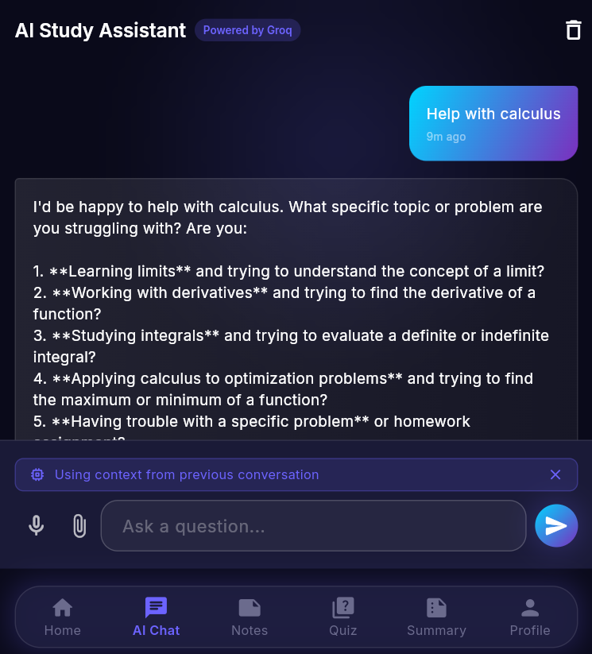
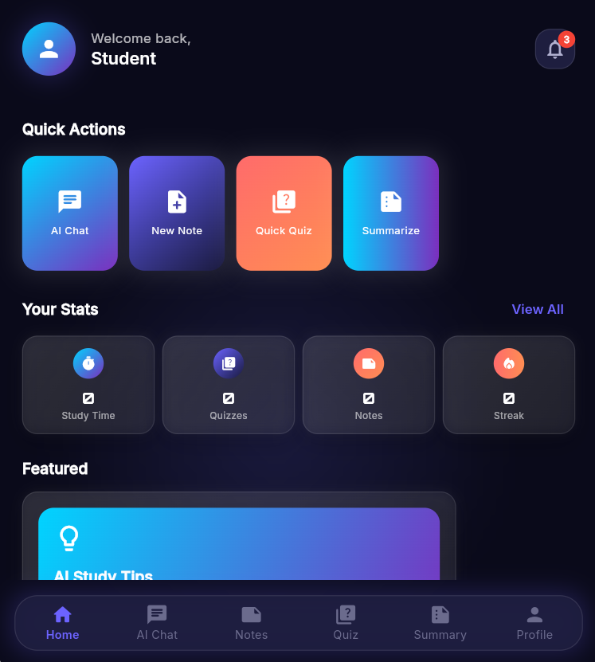
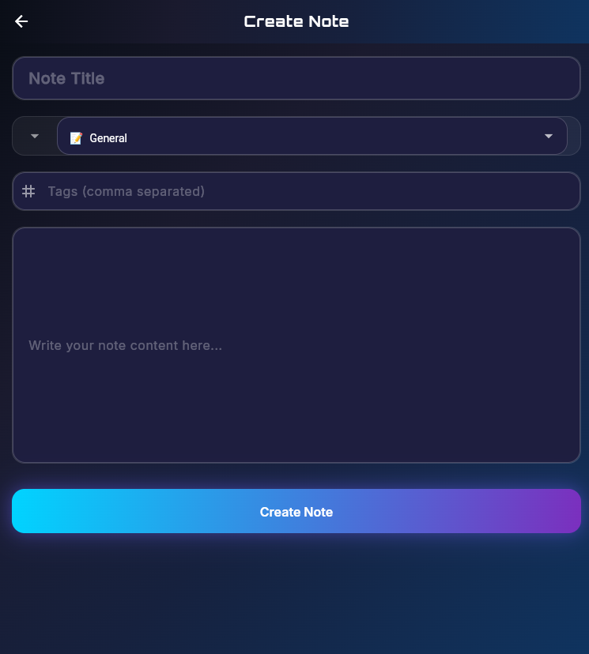
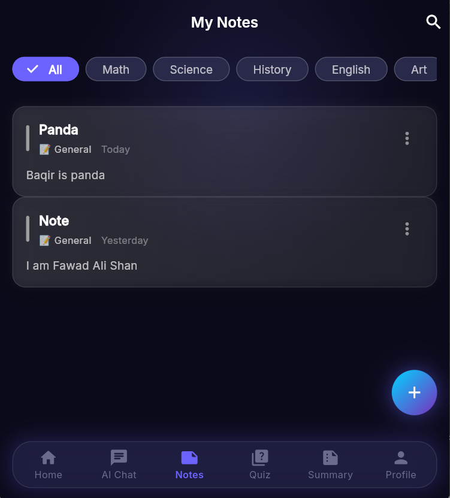
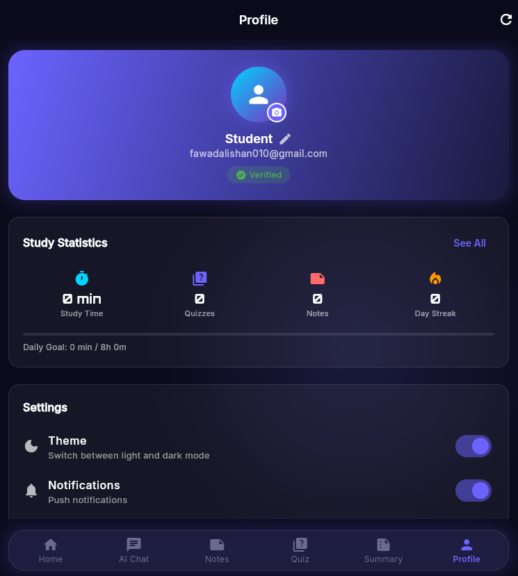
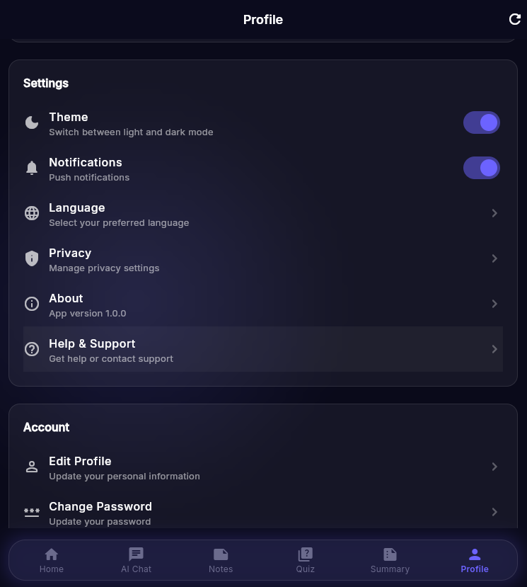
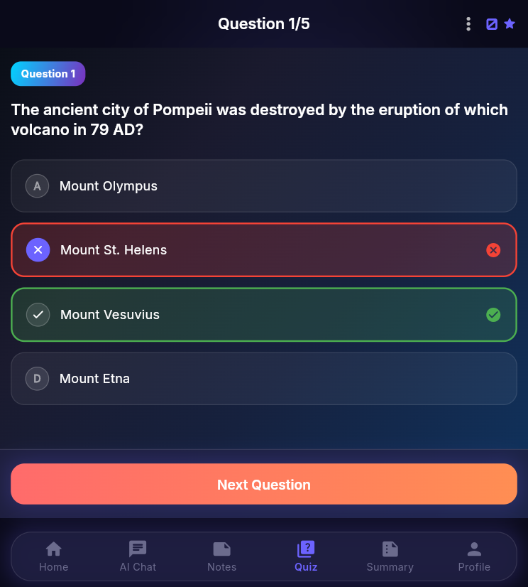
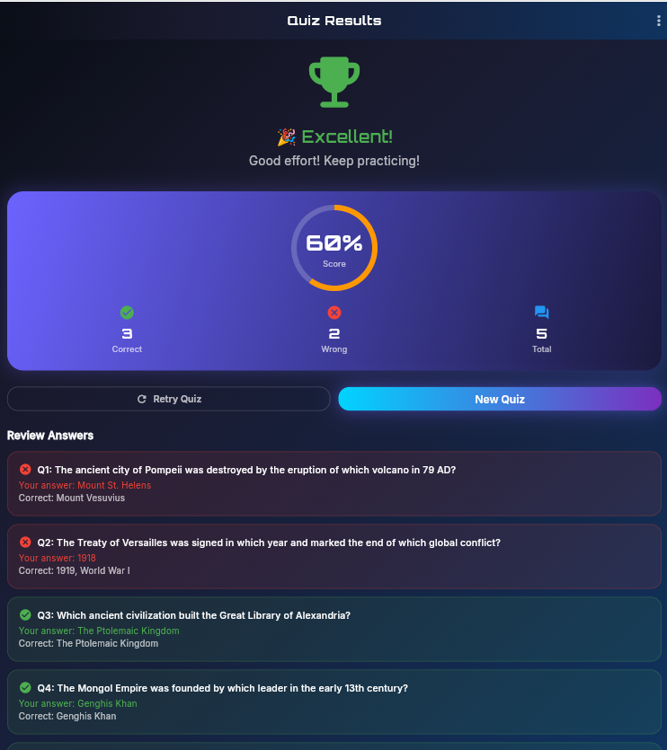
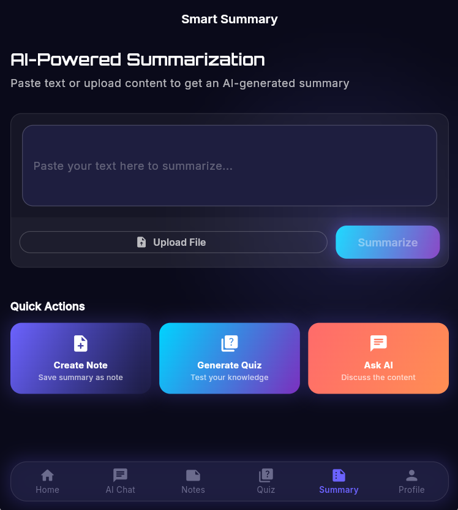

  📘 AI Study Buddy

 🎯 Overview

**AI Study Buddy** is a smart learning assistant designed to help students understand complex topics, organise their study materials, and prepare for exams efficiently using AI.
 
 🧩 Problem It Solves

Students often struggle with:

* Understanding large or difficult study materials
* Creating effective revision content
* Staying organised with notes and study resources

 💡 Solution

AI Study Buddy provides an all-in-one platform where students can:

* Summarise content instantly using AI
* Generate quizzes for self-testing
* Save and manage study notes
* Improve learning efficiency with personalised AI support


👥 Target Users: Students (school, college, self-learners)


🌐 Live App

👉 Click here to use the app:
🔗 https://ai-study-buddy-29cb6.web.app

Note: It is a mobile App Basically but i have to make it for web to deploy. Because i don't have the google console acount and here is no time to use alternate.


  ✨ Features

* 🧠 AI Content Summarisation
  Paste any text and get a simplified summary instantly

* ❓ AI Quiz Generator**
  Generate quiz questions from your notes

* 📝 Notes Management
  Create, save, edit, and delete study notes

* 📊 Quiz Interaction
  Answer questions and view results

* 🔐 User Authentication
  Secure login/signup using Firebase

* ☁️ Cloud Storage
  Notes and data stored using Firestore
Note: Firebase storage is not available for now is it is paid. So this screen may not functional.

---

 🤖 AI Feature

### 🔍 What It Does

The AI feature helps users:

* Summarise study material
* Generate quiz questions on selected topic
* AI chatbot for any querry

 🧠 System Prompt (AI Instructions)

```
You are an AI study assistant.

Your job is to:
1. Summarize the given text into clear, easy-to-understand points.
2. Generate quiz questions based on the content.
3. Keep answers concise and correct and student-friendly.
4. Focus on key concepts only.

Always respond in structured format:
- Summary
- Quiz Questions
```

 ⚙️ AI Model Used

* Groq API (LLM for fast responses)(llama model)


 🛠️ Tools & Technologies

* Frontend: Flutter
* Backend: Firebase
* Database: Firestore
* Authentication: Firebase Auth
* AI Integration: Groq API
* Hosting: Firebase Hosting

📸 Screenshots

 











 🚀 How to Run the Project

 🔧 Prerequisites

* Flutter SDK installed
* Firebase project setup
* Groq API key


 📥 Steps o run the and use he project

1. Clone the repository:

```
git clone https://github.com/yourusername/ai-study-buddy.git
cd ai-study-buddy
```

2. Install dependencies:

```
flutter pub get
```

3. Create a `.env` file:

```
GROQ_API_KEY=your_api_key
FIREBASE_API_KEY=your_firebase_key
```

4. Run the app:

```
flutter run
```

 🔐 Environment Variables

| Variable         | Description         |
| ---------------- | ------------------- |
| GROQ_API_KEY     | API key for AI      |
| FIREBASE_API_KEY | Firebase config key |


 📌 Important Notes

* ❌ API keys are NOT included in this repo
* ✅ Use `.env.example` as a template
* ✅ Make sure Firebase is configured correctly


 🧪 Project Status

✅ Completed
✅ Fully functional(the summary screen functionality will not work which need firebase storage which is paid and not available)
✅ Deployed live


 👨‍💻 Author

Fawad Ali Shan
GitHub: https://github.com/FawadAliShan010


📢 Final Notes

This project was built as a **complete end-to-end AI-powered application**, solving a real student problem using modern tools like Flutter, Firebase, and AI integration.


